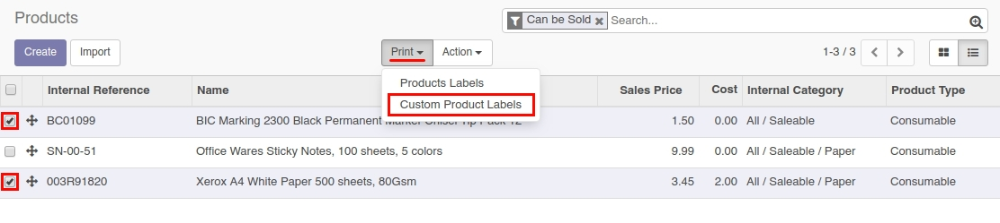
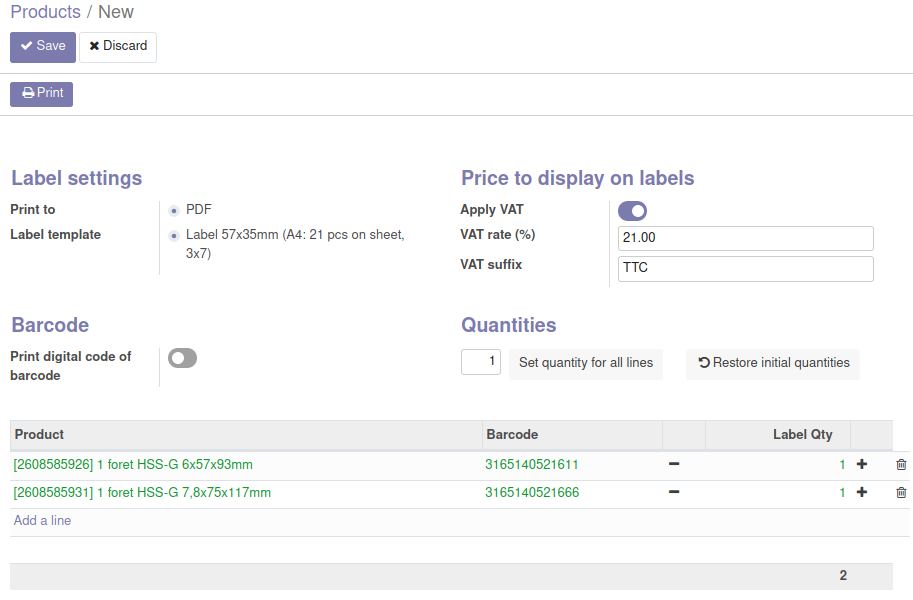
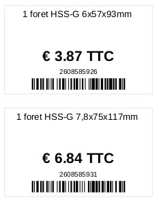

# ML Product Label

Printing custom product barcode labels on different paper formats.

## Module features

This module allows to print product labels with the following parameters:

  * Label size: 57x35mm
  * Paperformat: A4
  * Labels on sheet: 21 pcs
  * Labels per row: 3 pcs
  * Number of rows per page: 7

## Usage

Follow these steps to print a product labels:

  * Go to the **Products** or **Product variants** catalog.
  * Select one or multiple products.
  * Go to the **Print** menu and click on **Custom Product Labels**.

In the wizard form:

  * Select a **Label template**.

    Templates may have different sizes and paper formats.

  * Choose if you want to display the prices including VAT or not.

    You can specify the VAT rate to use and an optional string suffix to display after the price.

    The prices are rounded according to the product's currency parameters.

  * Check **Print digital code of barcode** if you want to see the text of the barcode under the barcode itself.

  * Change the quantity of labels (if necessary).

    You can input the quantity or use **-** / **+** buttons.

  * If you need to set a certain quantity for **all** labels, enter the value and click on **Set quantity for all lines**.
  * After changing the label quantities you can restore the initial values. Click the button **Restore initial quantities** for this.
  * Click on **Print**.

Labels will be generated in the PDF format:

